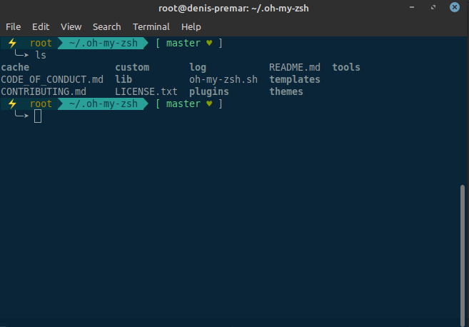

# DTheme

This is a theme for [oh-my-zsh](https://ohmyz.sh/) best optimized for people who use;

- Solarized
- Git
- Unicode-compatible fonts and terminals

# Usage

- Refer to the official website https://ohmyz.sh/ to install oh-my-zsh
- After oh-my-zsh, clone this them to your local machine using;

  For SSH: :point_down:

  > `git clone git@github.com:OlukaDenis/DTheme.git`

  For HTTP: :point_down:

  > `git clone https://github.com/OlukaDenis/DTheme.git`

  Then:

  > `cd DTheme`

- Copy the `DTheme.zsh-theme` located inside the DTheme folder

- Paste it into the `~/.oh-my-zsh/themes/` located at your home directory

- Edit the `~/.zshrc` and set;
  `ZSH_THEME="DTheme"`
- After you restart your machine
- Boom :boom:: Enjoy your new experience with the DTheme

# Contributing

If you are working on adding features, PRs, or bugfixes, this section should help get you going.

1. Fork this repo
2. Create your feature branch
   > `git checkout -b your-feature-branch`
3. Commit your changes
   > `git commit -am 'Add some feature'`
4. Push to the branch
   > `git push origin your-new-feature`
5. Create new Pull Request

##### Created by </ [Denis Oluka](https://github.com/OlukaDenis) >

### Follow me

- [Denis Oluka](https://www.facebook.com/dennylucaz) on Facebook

:wink:
